* 作者：afzw
* 创建时间：2022-09-08 16:12:35
* 最后修改人（意见提供者）：afzw
* 最后更新时间：2022-09-08 16:12:44
* 【转载】[原文链接](https://www.esensoft.com/industry-news/dx-5995.html)

# 什么是隐私计算

## 文章

​    **首先讲一个百万富翁比财富的故事：**

​    两个百万富翁街头邂逅，他们都想炫一下富，比比谁更有钱，但是出于隐私，都不想让对方知道自己到底拥有多少财富，如何在不借助第三方的情况下，让他们知道他们之间谁更有钱？

​    这是几十年前多方安全技术（隐私计算的一种技术）要解决的经典问题。**你也许马上就会想到，如果能在不知道对方数据的情况下进行数据的融合安全计算，从而获得一个有价值的结论，这不就是数据领域梦寐以求的东西吗？**

​    的确是这样，如果说深度学习的出现让AI焕发新生，那么数据流通和共享带来的巨大商机让隐私计算焕发出新生。

​    与传统的资本、土地、劳动、技术等一样，数据已是生产要素之一，与算力、算法组合，成为一种新型社会生产力，越来越多的业务场景需要多方数据的流通和共享。

​    在金融领域，银行保险机构借助内外部数据进行联合建模，实现数字营销、精准获客、差异化定价、智慧风控及反欺诈等。

​    在医疗领域、医药企业、医疗机构和保险公司通过病例数据共享，形成联合AI模型进一步提高精准度。

​    在政务、能源、交通、环保、工业和电信等具备大量数据基础的领域，数据共享和利用已经成为规划和落地应用必不可少的部分。

​    **隐私计算使企业在数据合规要求前提下，能够充分调动数据资源拥有方、使用方、运营方、监管方各方主体积极性，实现数据资源海量汇聚、交易和流通，从而盘活第三方机构数据资源价值，促进数据要素的市场化配置，在《国家数据安全法》颁布的当下，隐私计算更凸显价值。**

​    隐私计算其实是一堆“**数据可用不可见**”技术集合，包括**多方安全计算、联邦学习、机密计算、差分隐私及数据脱敏**等等，这些技术既有联系又有区别，既有优势也有劣势，如果你不明觉厉或者一知半解，一定要读一读这篇文章。

###     **一、隐私计算**

​    隐私计算是“隐私保护计算”（Privacy-Preserving Computation）的中文简称，没有统一的标准定义，这里摘取部分组织和文档的定义，基本表达了同样的意思，大家意会就行：

​    **中国隐私计算产业发展报告（2020-2021）[1]：**

​    隐私计算是指在提供隐私保护的前提下实现[数据价值](https://www.esensoft.com/products/espowermeta.html)挖掘的技术体系，而非单一技术，早期多被定义为隐私保护计算、隐私保护技术等。2016 年发布的《隐私计算研究范畴及发展趋势》正式提出“隐私计算”一词，并将隐私计算定义为“面向隐私信息全生命周期保护的计算理论和方法，是隐私信息的所有权、管理权和使用权分离时隐私度量、隐私泄漏代价、隐私保护与隐私分析复杂性的可计算模型与公理化系统。

​    **隐私保护计算技术研究报告 [2]：**

​    隐私计算是指在提供隐私保护的前提下，实现数据价值挖掘的技术体系。面对数据计算的参与方或意图窃取信息的攻击者，隐私保护计算技术能够实现数据处于加密状态或非透明（Opaque）状态下的计算，以达到各参与方隐私保护的目的。隐私保护计算并不是一种单一的技术，它是一套包含人工智能、密码学、数据科学等众多领域交叉融合的跨学科技术体系。隐私保护计算能够保证满足数据隐私安全的基础上，实现数据“价值”和“知识”的流动与共享， 真正做到“数据可用不可见。”

​    **大数据联合国全球工作组 [3]：**

​    隐私计算是一类技术方案，在处理和分析计算数据的过程中能保持数据不透明、不泄露、无法被计算方法以及其他非授权方获取。

​    **腾讯隐私计算白皮书2021 [4]：**

​    隐私计算（Privacy Computing）是一种由两个或多个参与方联合计算的技术和系统，参与方在不泄露各自数据的前提下通过协作对他们的数据进行联合机器学习和联合分析。隐私计算的参与方既可以是同一机构的不同部门，也可以是不同的机构。

​    由上可知，在隐私计算框架下，参与方的数据不出本地，在保护数据安全的同时实现多源数据跨域合作，可以破解数据保护与融合应用难题。

​    隐私保护计算架构可抽象为下图[2]，在隐私保护计算参考架构中，主要有**数据方**、**计算方**和**结果方**三类角色，数据方是指为执行隐私保护计算过程提供数据的组织或个人；计算方是指为执行隐私保护计算过程提供算力的组织或个人；结果放是指接收隐私保护计算结果的组织或个人。

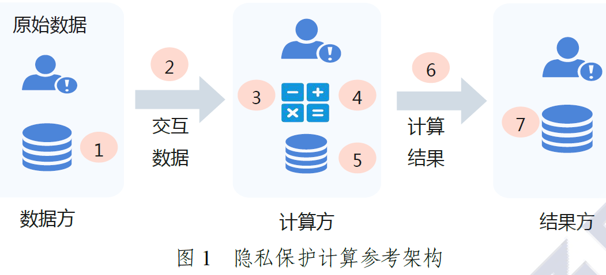

​    **隐私保护计算的目标是在完成计算任务的基础上，实现数据计算过程和数据计算结果的隐私保护。数据计算过程的隐私保护指参与方在整个计算过程中难以得到除计算结果以外的额外信息，数据计算结果的隐私保护指参与方难以基于计算结果逆推原始输入数据和隐私信息。**

​    从技术机制来看，隐私计算主要分为三大技术路线，即**安全多方计算（密码学）、联邦学习及机密计算**，有的会把侧重算法也单列一类，比如差分隐私等隐私相关的技术.

​    可以看到，隐私计算是个技术体系，不能混淆了安全多方计算、联邦学习、隐私计算概念间的关系，比如安全多方计算只是隐私计算的一个子集，联邦学习与安全多方计算也不是同一回事，虽然彼此也有联系。

​    下面针对隐私计算涉及的主要技术逐一介绍，每种技术会从**定义**、**图解**及**案例**三个角度去阐述，方便理解这些技术的本质和用途。

​    注：隐私计算涉及大量密码学、算法的知识，如需进一步理解，推荐去阅读相关的论文。

###     **二、多方安全计算**

​    多方安全计算（Secure Multi-Party Computation），MPC 由姚期智在1982 年提出，指参与者在不泄露各自隐私数据情况下，利用隐私数据参与保密计算，共同完成某项计算任务。

​    该技术能够满足人们利用隐私数据进行保密计算的需求，有效解决数据的“保密性”和“共享性”之间的矛盾。多方安全计算包括多个技术分支，目前，在MPC 领域，主要用到的是技术是秘密共享、不经意传输、混淆电路、同态加密、零知识证明等关键技术，你可以认为多方安全计算是一堆协议集。

####     **1、秘密共享**

​    **（1）定义**

​    秘密共享的思想是将秘密以适当的方式拆分，拆分后的每一个份额由不同的参与者管理，单个参与者无法恢复秘密信息，只有若干个参与者一同协作才能恢复秘密消息。更重要的是，当其中任何相应范围内参与者出问题时，秘密仍可以完整恢复。

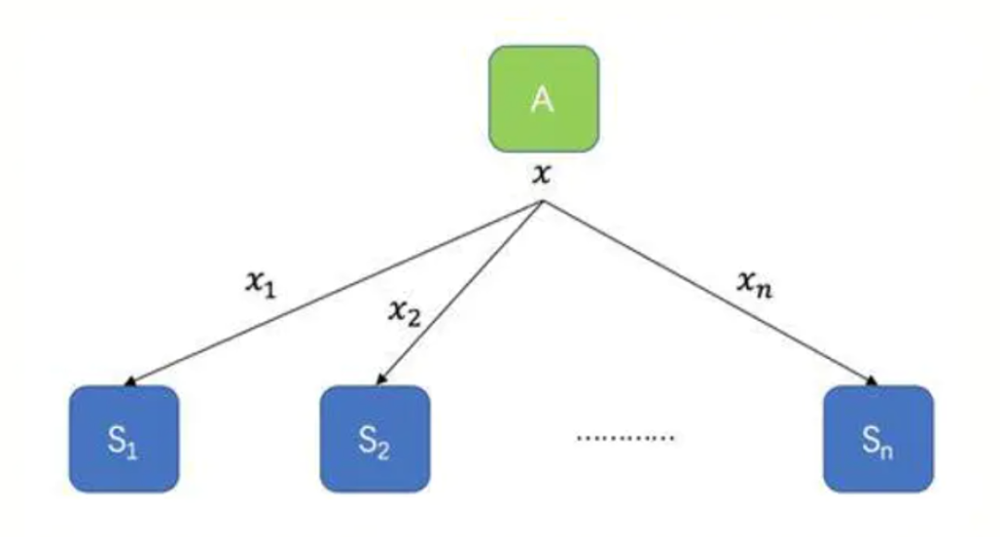

​    **（2）图解**

​    假如你和你的朋友们正在一起面临某种生存困境，比如在野外迷路了，或是被困在沙漠中，或是核冬天，或是丧尸来袭，你们难以获取食物，只好将剩下的食物的收集到一起放进保险箱。但是有个问题—你们并不相信其他人，其他人很可能趁大家不注意将食物偷走。这时候，保险箱的钥匙应该怎么保管？

​    shamir方案[5]就是指准备w把钥匙，至少要t把钥匙才能开启：

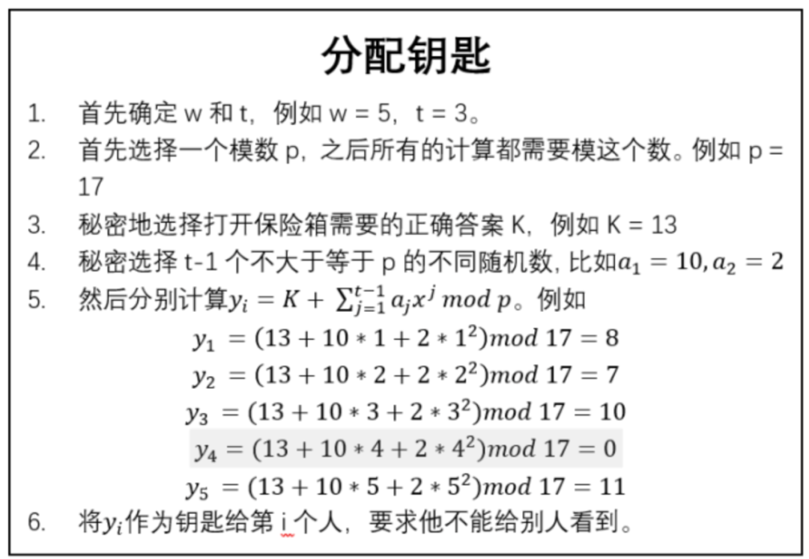

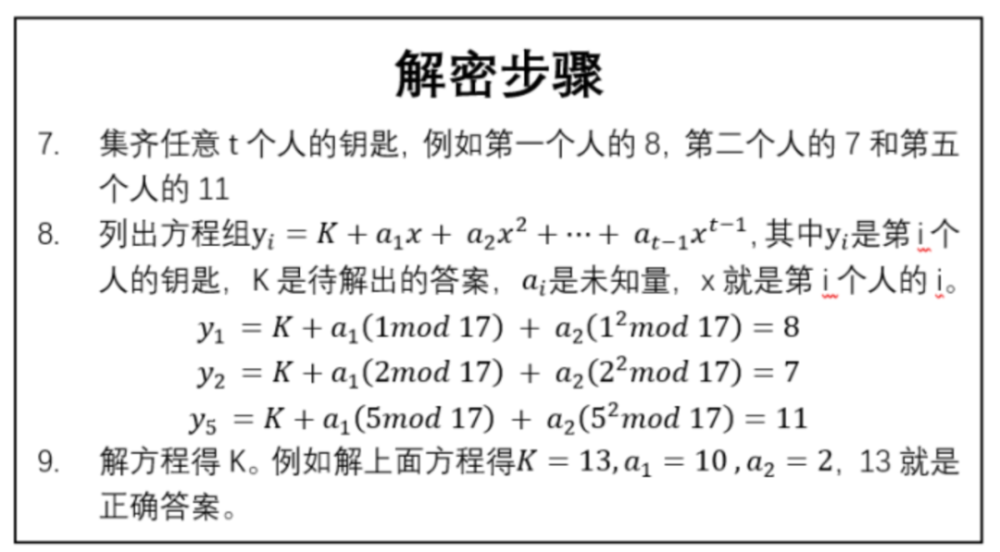

​    **（3）案例**

​    1994年，Naor和Shamir提出可视密码，是一种依靠人眼解密的秘密共享方法，它是将一个秘密图像加密成n张分存图像，n张分存图像可以打印到胶片上、存入电脑或移动存储器中，且分别由n个人保存。解密时只需k个人(或k个以上)将各自的分存图像叠加，秘密图像就会呈现出来，而少于k个人无法获得秘密图像的一点信息。

####     **2、同态加密**

​    **（1）定义**

​    同态加密是一种允许在加密之后的密文上直接进行计算，且计算结果解密后和明文的计算结果一致的加密算法。

​    这个特性属性对于保护信息的安全具有重要意义，利用同态加密技术可以先对多个密文进行计算之后再解密，不必对每一个密文解密而花费高昂的计算代价；利用同态加密技术可以实现无密钥方对密文的计算，密文计算无须经过密钥方，既可以减少通信代价，又可以转移计算任务，由此可平衡各方的计算代价，利用同态加密技术可以实现让解密方只能获知最后的结果，而无法获得每一个密文的消息，可以提高信息的安全性。

​    **（2）图解[1]**

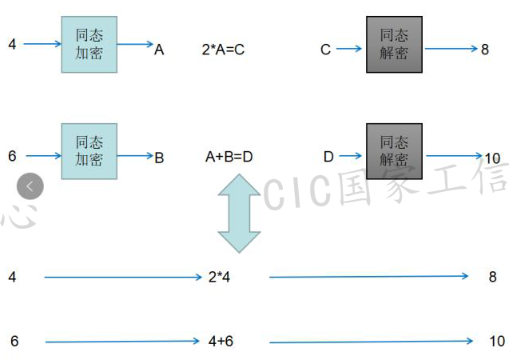

​    **（3）案例**

​    目前云计算应用中，从安全角度来说，用户还不敢将秘钥信息直接放到第三方云上进行处理，通过实用的同态加密技术，则大家可以放心使用各种云服务，同时各种数据分析过程中也不会泄露用户隐私。加密后的数据在第三方服务处理后得到加密后的结果，这个结果只有用户自身可以进行解密，整个过程第三方平台无法获知任何有效的数据信息。

####     **3、不经意传输**

​    **（1）定义**

​    不经意传输是一种可保护隐私的双方通信协议，消息发送者从一些待发送的消息中发送某一条给接收者，但并不知道接收者具体收到了哪一条消息。不经意传输协议是一个两方安全计算协议，协议使得接收方除选取的内容外，无法获取剩余数据，并且发送方也无从知道被选取的内容。

​    比如Alice每次发两条信息（m0、m1）给Bob，Bob提供一个输入，并根据输入获得输出信息，在协议结束后，Bob得到了自己想要的那条信息（m0或者m1），而Alice并不知道Bob最终得到的是哪条。

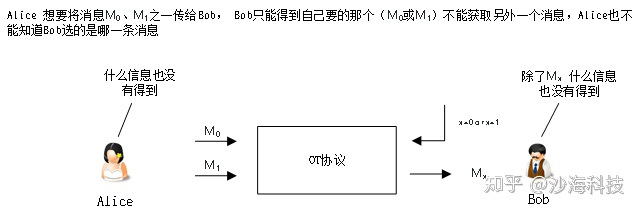

​    **（2）图解[6]**

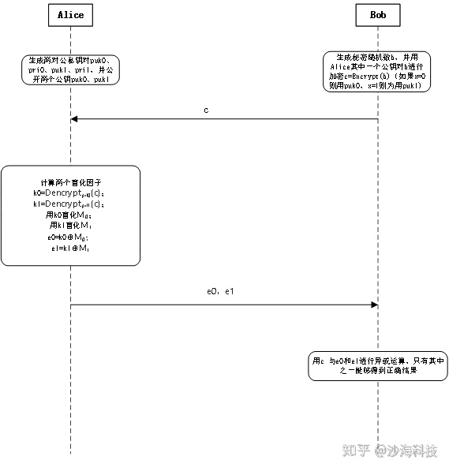

​    **流程：**

​    \1. 发送者Alice生成两对rsa公私钥，并将两个公钥puk0、puk1发送给接受者Bob。

​    \2. Bob生成一个随机数，并用收到的两个公钥之一加密随机数（用哪个秘钥取决于想获取哪条数据，例如如果想要得到消息M0 就用puk0加密随机数，如果想要得到M1就用puk1加密随机数），并将密文结果发送给Alice。

​    \3. Alice用自己的两个私钥分别解密收到随机数密文，并得到两个解密结果k0，k1，并将两个结果分别与要发送的两条信息进行异或（k0异或M0，k1异或M1），并将两个结果e0，e1发给Bob。

​    \4. Bob用自己的真实随机数与收到的e0、e1分别做异或操作，得到的两个结果中只有一条为真实数据，另外一条为随机数。

​    **分析：**

​    在此过程中第3步最为关键，如果Alice无法从用两条私钥解密得到的结果k0、k1中区分出Bob的真实随机数，则能保证Alice无法得知Bob将要获取的是哪条数据。Bob没有私钥也就无法得出真实的私钥解密结果（如果k0为真实随机数，Bob无法得知k1的值），所以也就只能得到自己想要的那条数据而无法得到另外一条，保障协议能执行成功。

​    **（3）案例**

​    Alice和Bob打牌，Alice总是输，为了让Alice的游戏体验好一点，Alice可以看Bob的某一张手牌的大小，但是Alice并不想让Bob知道看了哪张，不然很可能还是打不赢！这个场景下，就可以通过不经意传输来传递牌的大小，这样可以保证Alice只能看到一张的大小，且Bob不知道Alice看了哪一张牌。

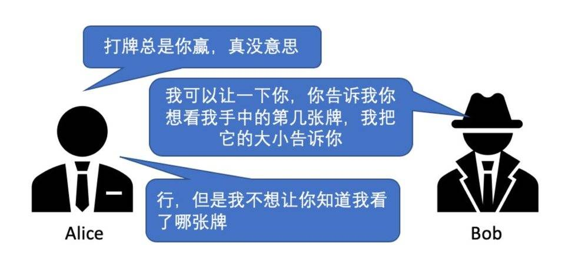

####     **4、零知识证明**

​    **（1）定义**

​    零知识证明指的是证明者能够在不向验证者提供任何有用信息的情况下，使验证者相信某个论断是正确的。允许证明者 prover、验证者 verifier 证明某项提议的真实，却不必泄露除了「提议是真实的」之外的任何信息。

​    举个最简单的阿拉伯童话《一千零一夜》里的零知识证明：阿里巴巴与四十大盗的故事其中一个片段。

​    阿里巴巴会芝麻开门的咒语，强盗向他拷问打开山洞石门的咒语，他不想让人听到咒语，便对强盗说：“你们离我一箭之地，用弓箭指着我，你们举起右手，我念咒语打开石门，举起左手，我念咒语关上石门，如果我做不到或逃跑，你们就用弓箭射死我。”

​    这个方案对阿里巴巴没损失，也能帮助他们搞清楚阿里巴巴到底是否知道咒语，于是强盗们同意。强盗举起了右手，只见阿里巴巴的嘴动了几下，石门打开了；强盗举起了左手，阿里巴巴的嘴动了几下，石门又关上了。强盗有点不信，没准这是巧合，多试几次过后，他们相信了阿里巴巴。这即是最简单易懂的零知识证明。

​    **（2）图解**

​    如图所示为零知识证明的一个经典模型—洞穴模型[7]，该模型不涉及具体算法实现，仅用于初步说明零知识证明的原理和效果：

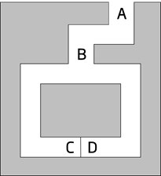

​    在图中，C点和D点之间存在一道密门，只有知道秘密口令的人才能打开。证明者（Prover）P知道秘密口令，并希望向验证者（Verifier）V证明，但又不希望泄露秘密口令，可通过以下证明过程实现：

​    第一步，验证者V站在A点，证明者P站在B点；

​    第二步，证明者P随机选择走到C点或D点，验证者V在A点无法看到证明者P选择的方向；

​    第三步，验证者V走到B点，并要求证明者P从左通道/右通道的方向出来；

​    第四步，证明者P根据验证者V的要求从指定方向出来，如有必要需要用秘密口令打开密门。

​    如果证明者P知道秘密口令，就一定能正确地从验证者V要求的方向出来；如果证明者P不知道秘密口令，则每次有1/2的概率能从验证者V要求的方向出来。该证明过程可重复进行多次，直到验证者V相信证明者P拥有打开密门的秘密口令。

​    通过以上证明过程，证明者P就向验证者V完成了关于秘密口令的零知识证明，即证明过程不会泄露任何关于秘密口令的知识。

​    下面以默克尔树结构为例，实现零知识证明即意味着，如何证明某个人拥有L1 - L4这些原始数据，但又不需将数据公之于众？

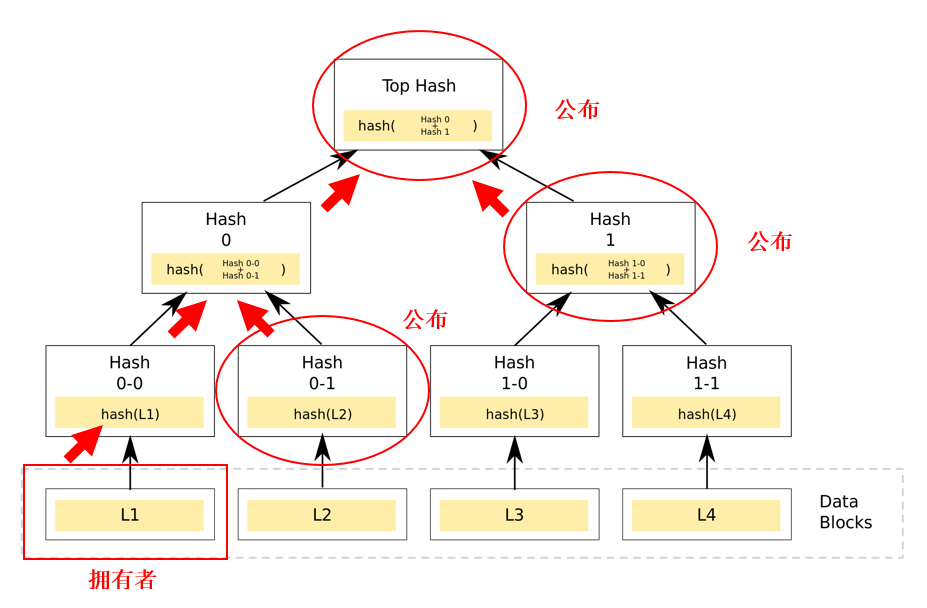

​    第一步：证明者可通过创建如图所示的默克尔树结构，然后对外公布Hash0-1、Hash1以及Top Hash（在哈希算法篇时，我们曾介绍过仅哈希值无法推导出原始数据）。

​    第二步：通过数据L1经哈希算法生成Hash0-0，然后根据公布的Hash0-1生成Hash0 ，再根据公布的Hash1生成Top Hash。如果最后生成的Top Hash值与公布的Top Hash值一致，则可证明他是拥有L1 - L4数据，而不需要公布这一系列的原始数据。这也就实现了零知识证明。

​    **（3）案例**

​    信任是业务往来的基础。做生意，无论在网上还是在现实世界中，我们需要知道和谁打交道，他们是否会履行承诺。问题是这以牺牲隐私为代价。为了判断某人是否值得信任，要了解他们是什么样的人，获取个人数据甚至信用卡号码。

​    常规的区块链交易，当资产从一方发送到另一方时，该交易的详细信息对网络中每一方都可见。相反，零知识证明交易中，其他人只知道发生了有效的交易，而不知道发送方、接收方、资产类别和数量。花费的身份和金额可以隐藏起来，并且可以避免诸如“抢先”之类的问题。

####     **5、混淆电路**

​    **（1）定义**

​    混淆电路是双方进行安全计算的布尔电路。混淆电路将计算电路中的每个门都加密并打乱，确保加密计算的过程中不会对外泄露计算的原始数据和中间数据。双方根据各自的输入依次进行计算，解密方可得到最终的正确结果，但无法得到除结果以外的其他信息，从而实现双方的安全计算。

​    **（2）图解**

​    现在要说说混淆电路具体是如何工作的了。注意关键词“电路（circuit）”，我们知道可计算问题都可以转换为一个个电路，于是就有了加法电路、比较电路和乘法电路等等。

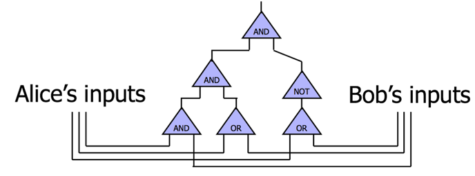

​    如上图所示，Alice和Bob想要搞点事情，他们搞了个电路，电路里面有一些门，每个门包括输入线（input wire）和输出线（output wire）。混淆电路就是通过加密和扰乱这些电路的值来掩盖信息的。在最经典的混淆电路中，加密和扰乱是以门为单位的。每个门都有一张真值表。比如下图就是与门的真值表和或门的真值表。下面就以与门为例来说明混淆电路的工作原理。

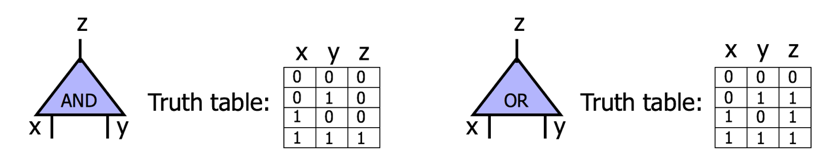

​    Alice和Bob想计算一个与门。该门两个输入线x和y和一个输出线z，每条线有0和1两个可能的值。Alice首先给每条线指定两个随机的key，分别对应0和1。

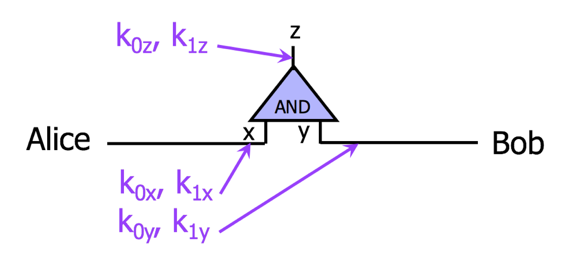

​    然后，Alice用这些密钥加密真值表，并将该表打乱后发送给Bob。加密过程就是将真值表中每一行对应的x和y的密钥key加密z的密钥。这一加密+打乱的过程，就是混淆电路（garbled circuit）的核心思想。

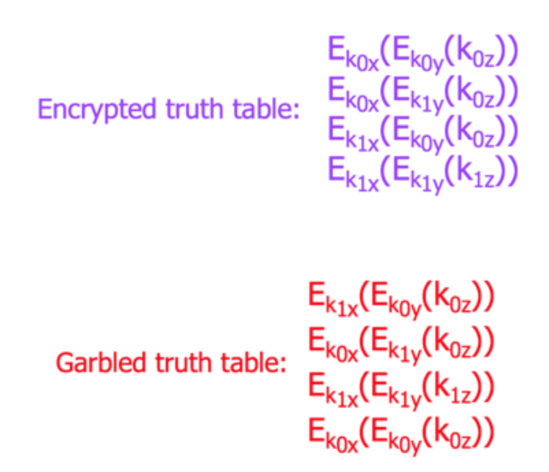

​    那Bob收到加密表后，如何计算呢？

​    首先Alice把自己的输入对应的key发给Bob，比如Alice的输入是0，那就发K0x，输入是1就发 K1x。同时通过不经意传输把和Bob有关的key都发给Bob，也就是K0y和K1y ，然后Bob根据自己的输入挑选相关的key，但Alice并不知道Bob选了哪个key。

​    Bob根据收到的Kx和自己的Ky ，对上述加密表的每一行尝试解密，最终只有一行能解密成功，并提取出相应的Kz。

​    Bob将Kz发给Alice，Alice通过对比是还是K0z还是K1z得知计算结果是0还是1。由于整个过程大家收发的都是密文或随机数，所以没有有效信息泄露。

​    **（3）案例**

​    目前来说，安全多方计算主要是通过混淆电路及秘密共享两个方式实现。基于混淆电路的协议更适用于两方逻辑运算，通讯负担较低，但拓展性较差。而基于秘密分享的安全多方计算其拓展性较强，支持无限多方参与计算，计算效率高，但通讯负载较大。

###     **三、联邦学习**

####     **（1）定义**

​    假设有两个不同的企业 A 和 B，它们拥有不同的数据，比如企业 A 有用户特征数据，企业 B 有产品特征数据和标注数据。这两个企业按照 GDPR 准则是不能粗暴地把双方数据加以合并的，因为他们各自的用户并没有机会同意这样做。

​    假设双方各自建立一个任务模型，每个任务可以是分类或预测，这些任务也已经在获得数据时取得了各自用户的认可。

​    那么，现在的问题是如何在 A 和 B 各端建立高质量的模型。但是，又由于数据不完整（例如企业 A 缺少标签数据，企业 B 缺少特征数据），或者数据不充分（数据量不足以建立好的模型），各端有可能无法建立模型或效果不理想。联邦学习就是来解决这个问题的。

​    联邦学习的本质是一种机器学习框架，即分布式机器学习技术。联邦学习以一个中央服务器为中心节点，通过与多个参与训练的本地服务器（以下简称“参与方”）交换网络信息来实现人工智能模型的更新迭代。

​    即中央服务器首先生成一个通用神经网络模型，各个参与方将这个通用模型下载至本地并利用本地数据训练模型，将训练后的模型所更新的内容上传至中央服务器，通过将多个参与方的更新内容进行融合均分来优化初始通用模型，再由各个参与方下载更新后的通用模型进行上述处理，这个过程不断重复直至达到某一个既定的标准。

​    在整个联邦学习的过程中，各参与方的数据始终保存在其本地服务器，降低了数据泄露的风险。[1]

####     **（2）图解**

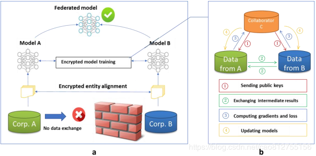

​    我们以包含两个数据拥有方（即企业 A 和 B）的场景为例介绍联邦学习的系统构架。该构架可扩展至包含多个数据拥有方的场景。假设企业 A 和 B 想联合训练一个机器学习模型，它们的业务系统分别拥有各自用户的相关数据。

​    此外，企业 B 还拥有模型需要预测的标签数据。出于数据隐私保护和安全考虑，A 和 B 无法直接进行数据交换，可使用联邦学习系统建立模型。联邦学习系统构架由三部分构成。

​    **第一部分**：加密样本对齐。由于两家企业的用户群体并非完全重合，系统利用基于加密的用户样本对齐技术，在 A 和 B 不公开各自数据的前提下确认双方的共有用户，并且不暴露不互相重叠的用户，以便联合这些用户的特征进行建模。

​    **第二部分**：加密模型训练。在确定共有用户群体后，就可以利用这些数据训练机器学习模型。为了保证训练过程中数据的保密性，需要借助第三方协作者 C 进行加密训练。以线性回归模型为例，训练过程可分为以下 4 步：

​    **第①步**：协作者 C 把公钥分发给 A 和 B，用以对训练过程中需要交换的数据进行加密，注意传输的数据是模型的计算中间结果（后面会解释具体是什么），不涉及用户隐私，当然虽然传输的数据是加密的，但模型训练的时候是要用私钥解密的。

​    **第②步**：A 和 B 之间以加密形式交互用于计算梯度的中间结果，那个这个中间结果具体指什么呢？

​    我的理解是这样：

​    假设A上有样本的X1,X2特征，B上有样本的X3,X4特征及标签Y，模型为logistic回归；首先，A根据当前模型计算每条记录的X1,X2线性组合结果，B根据当前模型计算每条记录的X3,X4线性组合结果；然后A将结果加密后传给B，同时B将结果加密后传给A。

​    **第③步**：A和B分别基于解密后的交互中间信息（线性组合结果）进行各自的梯度值计算，比如B可基于接收的线性组合结果、标签Y等数据计算LOSS（损失）及X3、X4的梯度，A接收后可计算LOSS（损失）及X1,X2的梯度。

然后A,B分别将计算得到的X1,X2,X3,X4的梯度值上传到C，C基于梯度值计算出模型的新参数。

​    **第④步**：C将四个新参数分别传送回A和B，也就是更新A,B的模型，用于新一轮的迭代。

​    迭代上述步骤直至损失函数收敛，这样就完成了整个训练过程。在样本对齐及模型训练过程中，A 和 B 各自的数据均保留在本地，且训练中的数据交互也不会导致数据隐私泄露。因此，双方在联邦学习的帮助下得以实现合作训练模型。

​    模型正式部署到生产后，如果要用于预测，比如输入一个用户ID，则A,B模型分别提供预测的线性组合结果并相加，从而得到最终的预测值。

​    **第三部分**：效果激励。联邦学习的一大特点就是它解决了不同机构要加入联邦共同建模的问题，提供数据多的机构所获得的模型效果会更好，模型效果取决于数据提供方对自己和他人的贡献。这些模型的效果在联邦机制上会分发给各个机构反馈，并继续激励更多机构加入这一数据联邦。以上三部分的实施，既考虑了在多个机构间共同建模的隐私保护和效果，又考虑了以一个共识机制奖励贡献数据多的机构。

####     **（3）案例**

​    金融行业中面向金融机构与政府基于联邦学习技术进行联合建模的落地应用。例如金融机构结合其服务企业的金融行为、资产等特征与政府的企业信息、企业税务信息、企业违规信息等特征，采用纵向联邦学习联合建模开展企业的信用风控评估。金融机构间通过同一用户群的金融行为数据采用纵向联邦学习联合分析金融反欺诈。

###     **四、机密计算**

####     **（1）定义**

​    机密计算就是针对数据在使用过程中的安全问题所提出的一种解决方案。它是一种基于硬件的技术，将数据、特定功能、应用程序，同操作系统、系统管理程序或虚拟机管理器以及其他特定进程隔离开来，让[数据存储](https://www.esensoft.com/products/petabase.html)在可信执行环境（Trusted Execution Environment，TEE）中，即使是使用调试器，也无法从外部查看数据或者执行操作。TEE确保只有经过授权的代码才能访问数据，如果代码被篡改，TEE将阻止其继续进行操作。

​    机密计算的核心功能有：

​    第一、保护 In-Use 数据的机密性：内存中的数据是被加密的，即便被攻击者窃取到内存数据也不会泄露数据；

​    第二、保护 In-Use 数据的完整性：度量值保证了数据和代码的完整性，使用中有任何数据或代码的改动都会引起度量值的变化；

​    第三、保护 In-Use 数据的安全性：相比普通应用，机密计算应用有更小的 TCB（Trusted Compute Base），意味着更小的攻击面，也意味着更安全。，以 Intel SGX 为例，除了 CPU 和可信应用自身以外，其他软硬件的访问都是被拒绝的，包括操作系统、Hypervisor 等。

####     **（2）图解**

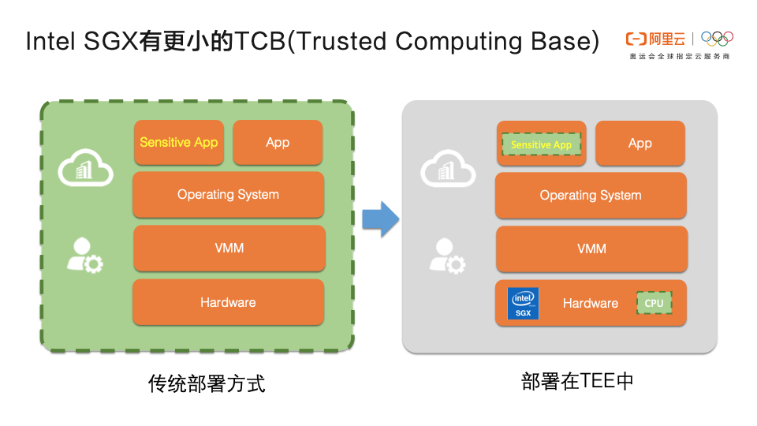

​    按照普通方式部署敏感应用，应用会依赖操作系统、VMM、硬件甚至是云厂商，TCB 非常大，面临的攻击面也非常大。只要 TCB 中只要有一处遭到攻击，应用都有数据泄露和破坏的风险。

​    而把敏感应用部署在 Intel SGX 的 TEE 中，TCB 只有 CPU 和 TEE 本身。一方面攻击面变得很小，另一方面 TEE 的安全机制也会使应用更安全。

####     **（3）案例[9]**

​    支持 TEE 的硬件平台主要有 3 个：Intel SGX、ARM TrustZone 和 AMD SEV，它们有不同的应用场景和实现方式：

​    ARM TrustZone把硬件资源分为安全世界和非安全世界两部分，所有需要保密的操作在安全世界执行，其余操作在非安全世界执行，安全世界和非安全世界通过一个名为 Monitor Mode 的模式进行转换。典型的应用场景有移动支付、数字钱包等；

​    AMD 利用 SEV（AMD Secure Encrypted Virtualizationn），SME（AMD Secure Memory Encryption）和SEV-ES（Secure Encrypted Virtualization-Encrypted State）等技术实现虚拟机的 Guest 内存加密和安全隔离；

​    Intel SGX 是 Intel 提供的一组指令，用于提高应用的代码和数据的安全性，用户可以把敏感数据放入到 Encalve 中，Enclave 是一种受保护的可信执行环境。阿里云 ACK-TEE 和开源项目 Inclavare Containers 都是基于 Intel SGX 实现的机密计算。

###     **五、差分隐私**

####     **（1）定义**

​    差分隐私(Differential Privacy)是Dwork[3] 在2006年针对数据库的隐私泄露问题提出的一种新的隐私定义。主要是通过使用随机噪声来确保，查询请求公开可见信息的结果，并不会泄露个体的隐私信息，即提供一种当从统计数据库查询时，最大化数据查询的准确性，同时最大限度减少识别其记录的机会，简单来说，就是保留统计学特征的前提下去除个体特征以保护用户隐私。

​    举个例子，当不使用差分隐私技术时，我们查询A医院数据库，查询今日就诊的100个病人患病情况，返回10人患肺癌，同时查询昨天99个病人患病情况，返回9个人患肺癌，那就可以推测今天来的那个人张三患有肺癌，这个就暴露了张三的个人隐私了。

​    使用差分隐私技术后，查询A医院的数据库，查询今日就诊的100个病人患病情况，返回肺癌得病率9.80%，查询今日就诊的99个病人患病情况，返回肺癌得病率9.81%，因此无法推测剩下1个人张三是否患有肺癌。

####     **（2）图解**

​    当用户(也可能是潜藏的攻击者)向数据提供者提交一个查询请求时，如果数据提供者直接发布准确的查询结果，则可能导致隐私泄漏，因为用户可能会通过查询结果来反推出隐私信息。

​    为了避免这一问题，在交互式差分隐私保护框架下,用户通过查询接口向数据拥有者递交查询请求，数据拥有者根据查询请求在源数据集中进行查询，然后将查询结果添加噪声扰动之后反馈给用户，在非交互式差分隐私保护框架 下，数据管理者直接发布一个满足差分隐私保护的数据集,再根据用户的请求对发布数据集进行查询操作，如下图所示。

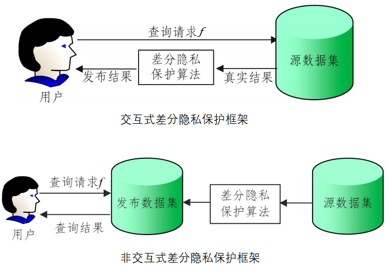

​    假设存在一个数据表，该数据是某医院的门诊病历记录，其中包括病人的姓名、年龄、性别、临床诊断等信息。

​    图（a）是原始数据记录的直方图发布形式。如果攻击者想要知道Cole的诊断情况，并且具有强大的背景知识，如攻击者已经知道Cole的性别为男、年龄在60~80岁之间，以及其他人的临床诊断信息，那么攻击者将能够推断出Cole的临床诊断信息，从而导致Cole的隐私信息被泄露。

​    图（b）给出了经过差分隐私技术处理过的直方图发布的结果，从图中可以看出，即使攻击者知道年龄在60~80岁之间除了Cole以外所有人的信息，他也没办法获取Cole的诊断信息。

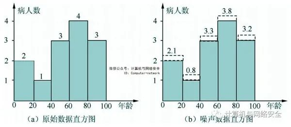

​    差分隐私中一个关键概念是相邻数据集，假设给定两个数据集D和D’，如果它们有且仅有一条数据不一样，那么这两个数据集可称为相邻数据集。

​    那么如果对于一个随机算法A如果其分别作用于两个相邻数据集得到的两个输出分布式难以区分的，那么这个算法就被认为达到差分隐私的效果。

​    这里的随机算法，是指对于特定输入，该算法的输出不是固定值，而是服从某一分布的算法，如下图所示，也就是说这个算法作用于任何相邻数据集（D和D’），得到一个特定输出O的概率是差不多，从而观察者通过观察输出结果很难觉察出数据集的细小变化，通过这种方式来达到保护隐私的目的。

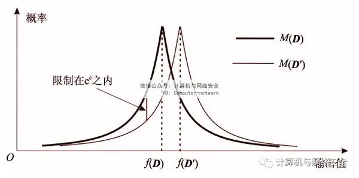

​    差分隐私的主要实现机制，主要是在输入或输出上加入随机化的噪音：拉普拉斯噪音(Laplace Noise)，高斯噪音(Gaussian Noise)，指数机制等。

####     **（3）案例**

​    差分隐私在1977年就提出了，但是真正让它声名大噪的是2016年苹果软件工程副总裁克雷格•费德里希(Craig Federighi)在WWDC大会上宣布苹果使用本地化差分隐私技术来保护IOS、MAC用户隐私。

​    在多个场景中成功部署差分隐私，在保护用户隐私的同时，提升用户体验。例如，使用差分隐私技术收集用户统计用户在不同语言环境中的表情符号使用情况，改进QuickType对表情符号的预测能力。

​    根据用户键盘输入学习新单词、外来词，更新设备内字典改善用户键盘输入体验。又例如，根据使用差分隐私技术收集用户在Safari应用使用中高频的高内存占用型、高耗能型域名，在IOS和macOS High Sieera系统里在这些网站加载时提供更多资源，以提升用户浏览体验。

###     **六、各类技术优缺点**

####     **1、多方安全计算**

​    **优点：**

​    基于密码学安全，其安全性有严格密码理论证明，不以信任任何参与方、操作人员、系统、硬件或软件为基础，各个参与方对其拥有的数据拥有绝对的控制权，保障基本数据和信息不会泄露，同时计算准确度高，并支持可编程通用计算。

​    **缺点：**

​    多方安全计算包含复杂的密码学操作，计算性能问题是应用的一大障碍。随着应用规模扩大，采用合适的计算方案保证运算时延与参与方数量呈现线性变化是目前各技术厂商面临的一大挑战。

​    从安全性上看，多方安全计算的目标是保证多方数据融合计算时的隐私安全，一些传统安全问题，如访问控制、传输安全等，仍然需要其他相应的技术手段。

####     **2、联邦学习**

​    **优点：**

​    联邦学习由于其具有分布式训练和联合训练的特点。

​    一方面能够解决训练阶段数据特征单一的问题，从而获得一个性能更好的、优于利用自己本身数据集所训练出的模型。

​    另一方面，各参与方只需在本地利用各自数据集进行训练，数据体量未增加，算力成本压力小。因为整个训练过程中各参与方的数据都不会离开本地，只将模型的梯度及权重等信息上传至中心服务器进行聚合分割，对于各参与方来说这样既不会直接泄露隐私数据，也不会额外增加参训数据量，从而完成训练任务。

​    **缺点：**

​    联邦学习存在着安全问题和通信效率问题。

​    一是就目前业内应用较大的神经网络模型来看，因为从底层编码开始构建一个基础的神经网络模型通常耗时耗力，多数企业从开源平台获取或第三方平台上购买基础模型，这样的基础模型本身就有植入病毒的可能。

​    二是学术界对于联邦学习的安全保障效果尚无严格定义，利用中心服务器收集的梯度及权重信息还是有可能反推出每个参与方的数据信息。

​    三是联邦学习的机制默认所有参与方都是可信方，无法规避某个参与方恶意提供虚假数据甚至病害数据，从而对最终的训练模型造成不可逆转的危害。

​    四是由于分布式参与节点计算能力不一致、网络连接状态不稳定、数据通信非独立分布等现实因素，联邦学习的通信效率极易成为联邦学习应用的瓶颈之一。

####     **3、机密计算**

​    **优点：**

​    相对于其他隐私计算技术，机密计算具有通用和高效的优势，不仅可以无缝支持通用计算框架和应用，而且计算性能基本可匹敌明文计算。它可以单独用于隐私计算，也可以与其他技术结合在一起来保护隐私，尤其对于安全可信云计算、大规模数据保密协作、隐私保护的深度学习等涉及大数据、高性能、通用隐私计算的场景，是重要的技术手段。

​    **缺点：**

​    机密计算的缺点在于TEE 信任链跟CPU 厂商绑定，目前硬件技术被掌握在英特尔、高通、ARM等少数外国核心供应商中，从而影响到机密计算技术的可信度。机密计算的另一个缺点是目前的TEE 实现在理论上存在侧信道攻击的可能性，因为TEE与其它非可信执行环境空间共享了大量的系统资源。

####     **4、差分隐私**

​    **优点：**

​    差分隐私技术基于严格的数据理论，能够实现数据资源的最大利用，在多方安全计算中，采用可计算的差分隐私能大大降低多方安全计算的计算复杂度和通讯量。

​    **缺点：**

​    差分隐私通过添加噪声实现隐私保护，会对模型可用性和准确性造成一定程度影响，因此，对于准确度要求较高的场景如人脸识别、金融风险计量，目前无法大规模应用该项技术。

​    另一方面差分隐私保护目标是计算结果而不是计算过程，以机器学习建模为例，差分隐私可以在建模结果上加入噪声，保证攻击者难以从建模结果反推出样本信息，但差分隐私依然需要计算方显式的访问训练数据，因此没有保护建模过程，因此与前面三种方案有根本不同。

​    最后，给一张关键技术评价表[4]：

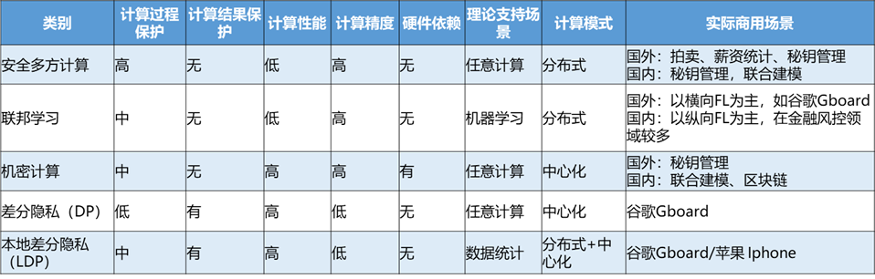

## 扩展阅读

1. [零知识证明](https://www.youtube.com/watch?v=FuKEpOhiVPg)